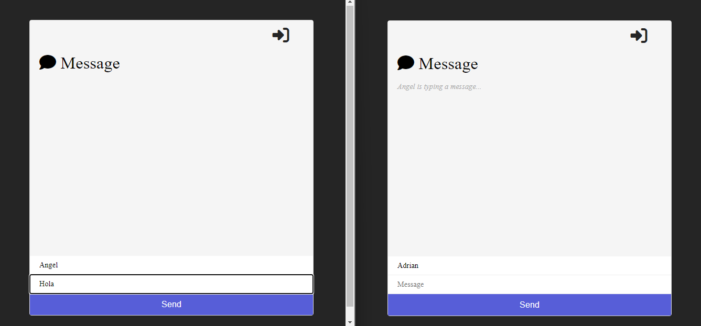
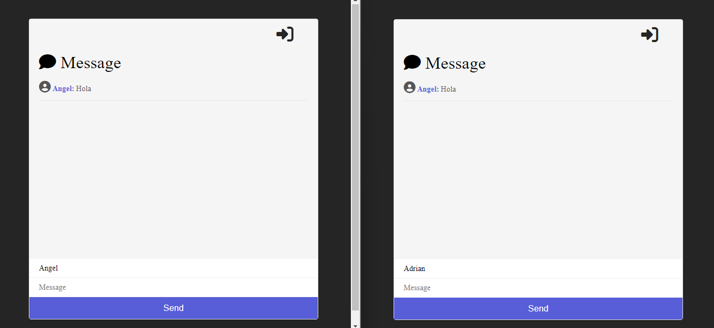
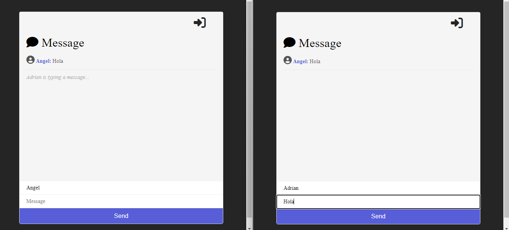
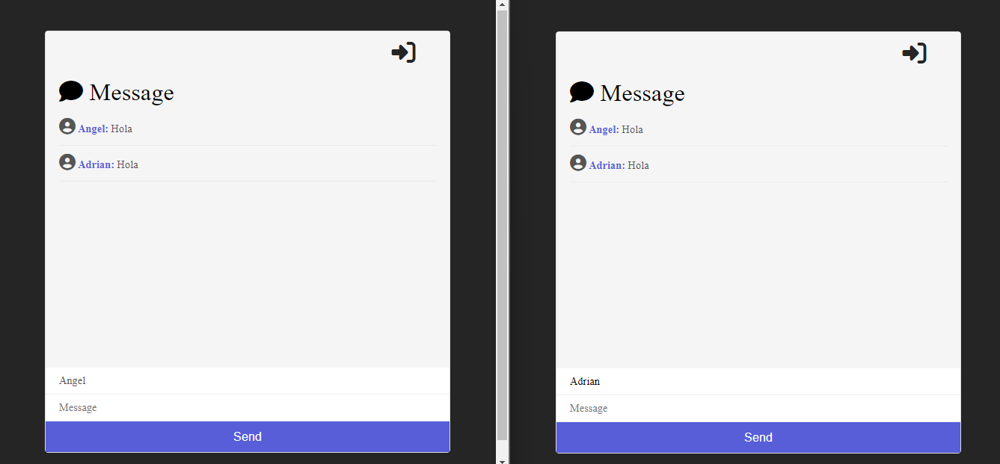

# Web Chat con sockets

Este es una aplicacion con el uso de sockets usando Node js.
Simula una red social en la que los usuarios interactuan llamada "Message".
Se tiene cuadros de texto donde podras poner el nombre de usuario
y el mensaje que se quiere transmitir.

Como podemos ver a la hora de la interaccion al momento de estar escribiendo
algo se refleja un mensaje de "(Usuario X) esta escribiendo..." antes de enviar
el mensaje, una vez se envie el mensaje se tendria que quitar dicho mensaje
por el mensaje que se enviara.

Podemos ver un icono de usuario junto con el nombre y el mensaje del usuario.

De igual manera el icono de puerta simula un logout (cierre de sesion) donde 
se deshabilita el cuadro de texto para enviar mensaje asi como el nombre de usuario.

